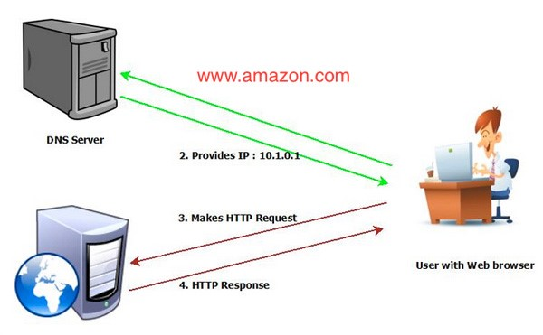
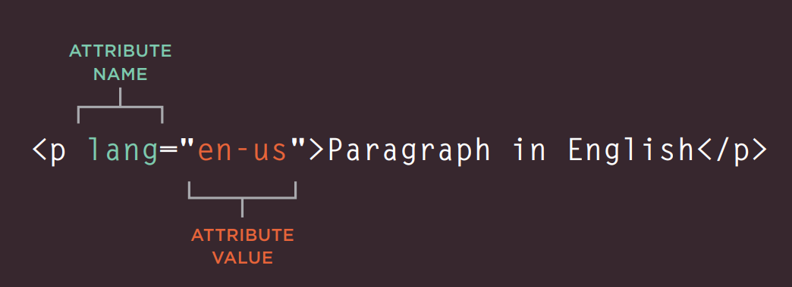
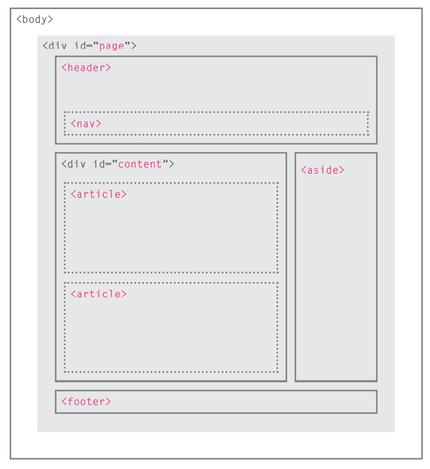
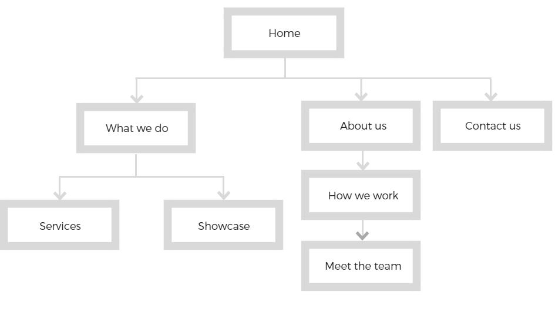

# Introduction : How the Web Works

1.	You connect to the internet via an ISP (Internet Service Provider)
2.	Using a browser, you visit a web site by entering the domain name for this web site
3.	The browser connects to the DNS (Domain Name System) server and gets the IP (Internet Protocol) address for the Web Server hosting that web site
4.	The browser then uses the IP and contacts the Web Server to retrieve the requested page

**See the diagram below**

# Chapter 1: Structure
HTML language is used to build or develop web sites and web pages.
HTML stands for Hyper Text Markup Language, It uses special elements to define the page structure and content, each HTML element consists of the following parts:
* Opening tag
* Closing tag
* Optionally, attributes within the opening tag  which tell us more about the content of that element

**For example the picture below shows the \<P\> element**

# HTML Chapter 8: “Extra Markup”

HTML has 3 main versions, HTML 4, XHTML 1.0, and the latest one is HTML5

**DOCTYPE** is used to tell the browser which version of HTML the page is using for example to declare HTML 5 we use **\<!DOCTYPE html\>** 

Some HTML elements not related to page structure and content for example:

* You can add comments to your code between the **\<!-- and --\>** markers.
* The **id** and **class** attributes allow you to identify particular elements.
* The **\<div\>** and **\<span\>** elements allow you to group block-level and inline elements together.
* **\<iframes\>** cut windows into your web pages through which other pages can be displayed.
* The **\<meta\>** tag allows you to supply all kinds of information about your web page.
* Escape characters are used to include special characters in your pages such as **\<**, **\>**, and **©**

# HTML Chapter 17: “HTML5 Layout”

HTML5 introduced new set of tags that indicate the purpose of different parts of a web page and help to describe its structure .

The following diagram shows how the new **header**, **footer**, **nav**, **article** and **aside** are used

# HTML Chapter 18: “Process & Design”

Designing a web site, one should know his target audience and potential visitors, he should ask himself the following questions:

- Who are the visitors?
- Why they are coming, their motivation and goals?
- What information they need in order to achieve their goals quickly and effectively?
- How often people will visit the site?

Early in the design process, the designers should create a site map which define the site structure and information hierarchy

Also main pages should have a clear structure by sketching a wireframe for each of them.
The wireframes make design easier because you know what information needs to appear on which page before considering how the page should look.

# JS Chapter 1: “The ABC of Programming”
JavaScript is a programming language that adds interactivity to web pages, it allows you to:
- Access content
- Modify content
- Program rules
- React to events

A script is a series of instruction that is interpreted and performed or executed by the browser or the script engine within the browser
To approach writing a script, break down your goal into a series of tasks and then work out each step needed to complete that task (a flowchart can help)

Just like many programming languages, JavaScript also uses the following same terminology:
- Object
- Method
- Event

**The End** 😅

