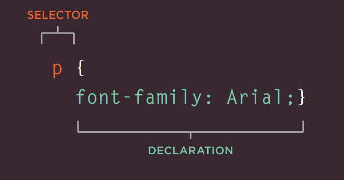
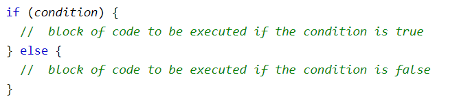
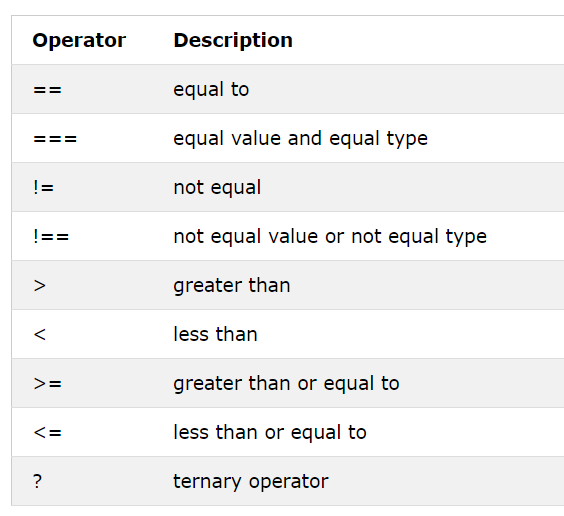
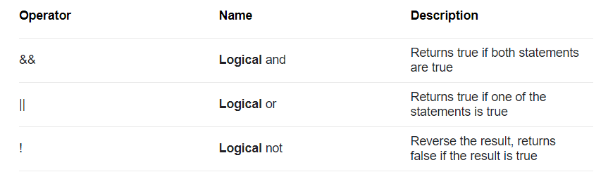

# Chapter 2: “HTML Text”

HTML element has a special set of tags for text content, some of them are structural like:
- Heading and subheadings  \<h1\> to \<h6\>
- Paragraphs \<p\>
- Bold \<b\> & Italic \<i\> and others.

Some other are semantic ones like:
- \<strong\> and \<em\>
- \<blockquote\> and \<q\>

----------------------------------------------------------------------------------------------------------------------------------------

# Chapter 10 “Introducing CSS”

CSS is used to style an HTML document, it describes how HTML elements should be displayed.
It works by associating rules with HTML elements. These rules govern how the content of specified elements should be displayed. A CSS rule contains two parts: **selector** and a **declaration**

 
CSS declarations sit inside curly brackets and each is made up of two parts: a property and a value, separated by a colon.

There are three ways you can use CSS within an HTML page :
- Inline
- Internal
- External

----------------------------------------------------------------------------------------------------------------------------------------

# Chapter 2: “Basic JavaScript Instructions” 

A script is a series of instructions that a computer can follow one-by-one. Each individual instruction or step is known as a statement. Statements should end with a semicolon.

A Variable is a container to store a value, and it used inside expressions and assignments.

JavaScript arrays are a special variable, which can hold more than one value at a time.

JavaScript has three main data types which are numbers, strings, and Boolean.

----------------------------------------------------------------------------------------------------------------------------------------

# Chapter 4: “Decisions and Loops”

JavaScript uses conditions and conditional statements to evaluate a **true** or **false** condition and execute one or more statements, for example the **if-else** statement:

 
## Comparison Operators
The table below shows comparison operators used within JavaScript

 
## Logical Operators
The table below shows logical operators as well
