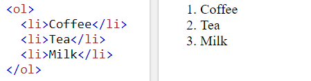
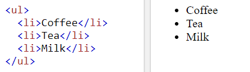
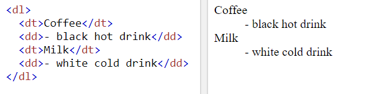

# Chapter 3: “Lists” 

HTML has three types of lists, these are:
- Ordered list 

- Unordered list

- Definition list

Also you can have nested list of these types.

----------------------------------------------------------------------------------------------------------------------------------------

# Chapter 13: “Boxes”
HTML uses the box concept for most of the element, for which you can control many styles such as:
- Width, Height 
- Border, Margin & Padding
- Display style (inline, block, inline-block)

----------------------------------------------------------------------------------------------------------------------------------------
 
# Chapter 2: “Basic JavaScript Instructions”
An Array is a special type of variable that stores a list of values, where each value can be of any data type and each value has an index within the array.

To define an array you can use :
- Literal array
- Array constructor

----------------------------------------------------------------------------------------------------------------------------------------
 
# Chapter 4: “Decisions and Loops”

The switch statement evaluates an expression, matching the expression's value to a case clause, and executes statements associated with that case, as well as statements in cases that follow the matching case.

JavaScript is a weak typing language, therefor data types can be coerced from one type to another.

There are three types of loops: **for**, **while**, and **do ... while**. Each repeats a set of statements.