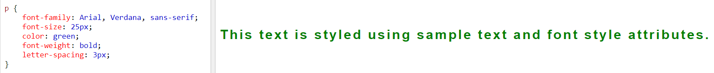

# Read: 05 - HTML Images; CSS Color & Text

Chapter 5: “Images”
Images are very substantial to web design, almost every web page has at least one or more images.

A picture can say a thousand words, and great images help make the difference between an average-looking site and a really engaging one.

There are mainly three type of images:
- JPEG which is used when you have many different colors in a picture.
- GIF or PNG which is used when you have images with few colors or large areas of the same color.

The *\* element is used to add images to a web page.

Here is NASA’s photo of the day


------------------------------------------------------------------------------------------------------------------------------

# Chapter 11: “Color”

Color not only brings your site to life, but also helps 
convey the mood and evokes reactions

There are three ways to specify colors in CSS: 
RGB values, hex codes, and color names as follows

### RGB Values
```
    p {
    color: rgb(100,100,90);
    }
```

### HEX Codes
```
    h2 {
    color: #ee3e80;
    }
```


### Color Name
```
    h1 {
    color: DarkCyan;
    } 
```

CSS3 added color opacity and the HSL (Hue Saturation Lightness) method of defining colors.

------------------------------------------------------------------------------------------------------------------------------

# Chapter 12: “Text”

HTML and CSS together provides many element and features to structure and style text, for example you can control font, size, weight, style, and spacing.

