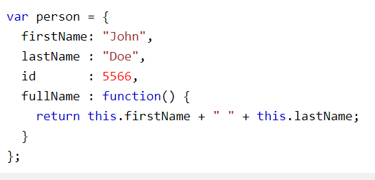

# Chapter 3: “Object Literals” 

The object is real life object, consist of properties and method.

There are several ways to create objects, but the easiest and most popular way is literal notation, as below:

------------------------------------------------------------------------------------------------------------------------------------------------

# Chapter 5: “Document Object Model” 

With the HTML DOM, JavaScript can access and change all the elements of an HTML document. 
When a web page is loaded, the browser creates a Document Object Model of the page.

The HTML DOM model is constructed as a tree of Objects that consists of four main types
- Document node
-	Elements nodes
-	Attribute node
-	Text node

The DOM also defines methods and properties to access and update each object in this model.
