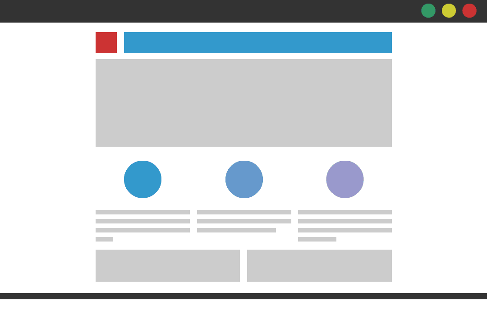

# More CSS Layout

Every HTML element has a default display value depending on what type of element it is. The default display value for most elements is block or inline. you can also use inline-block.

A block-level element always starts on a new line and takes up the full width available (stretches out to the left and right as far as it can).An inline element does not start on a new line and only takes up as much width as the content

You can position HTML element in different ways:
- Normal or static flow: which is the default position for an element
- Relative positioning: this shifts the element from its normal flow to the specified (top, right, bottom, or left)
- Absolute positioning: this shifts the element from its normal flow to the specified (top, right, bottom, or left) in relation to the containing or parent element.
- Fixed positioning: this shifts the element from its normal flow to the specified (top, right, bottom, or left) in relation to the whole page
- Also you can float elements using the float property

When designing for web, you should take into account:
- Screen size
-	Screen resolution
-	Page size

**There are two main layouts, a web designer can use:**
## Fixed Layout
Fixed width layout designs do not change size as the user increases or decreases the size of their browser window. Measurements tend to be given in pixels

## Liquid Layout
Liquid layout designs stretch and contract as the user increases or decreases the size of their browser window. They tend to use percentages

