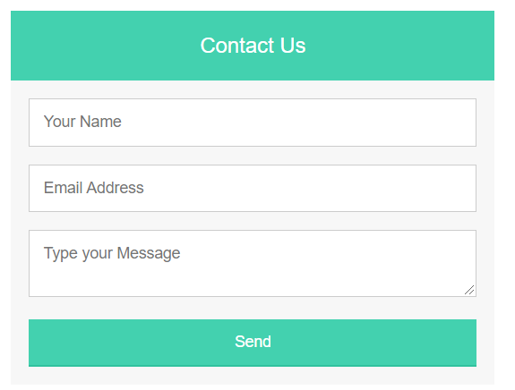
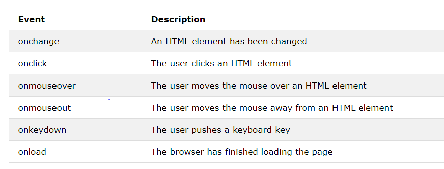

# Chapter 7: “Forms” 
HTML forms give you a set of elements to collect data from your users. The user input is most often sent to a server for processing in a Name/Value pairs
A **\<from\>** tag is used to with **action**(URL) and **method**(get/post) attributes to tell the browser where and how to send the collected input to the server
There are many input or form elements in HTML, for example:
-	Text
-	Password
-	Text Area
-	Radio (single choice)
-	Checkbox (multiple choice)
 
# Chapter 14: “Lists, Tables & Forms”
There are several CSS properties that were created to work with specific types of HTML elements, such as lists, tables, and forms where you can do the following:

- Specify the type of bullet point or numbering on lists 
- Add borders and backgrounds to table cells 
- Control the appearance of form 

 
# Chapter 6: “Events”
HTML events are browser or user actions that happen to HTML elements.
When JavaScript is used in HTML pages, JavaScript can "react" on these events.
An HTML event can be something the browser does, or something a user does.
Here are some examples of HTML events:
- An HTML web page has finished loading
- An HTML input field was changed
- An HTML button was clicked
Often, when events happen, you may want to do something.
JavaScript lets you execute code when events are detected.
HTML allows event handler attributes, with JavaScript code, to be added to HTML elements.

**Common HTML events**

When the user interacts with the HTML on a web page, there are three steps involved in getting it to trigger some JavaScript code. Together these steps are known as event handling
1. SELECT ELEMENT: Select the element you want the script to respond to
2. SPECIFY EVENT: Indicate which event on the selected element will trigger the response
3. CALL CODE: State the code you want to run when the event occurs

