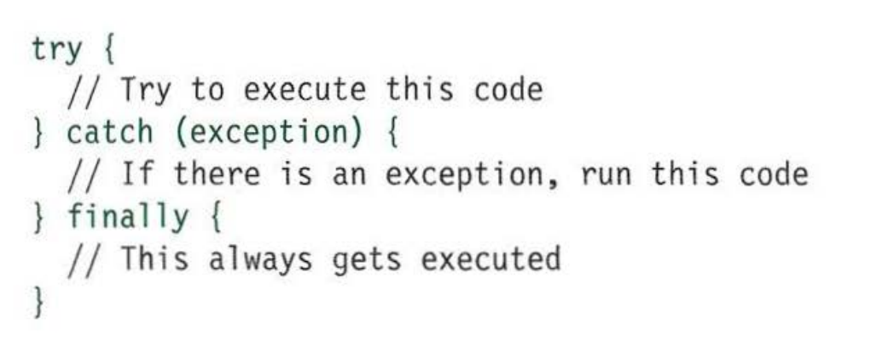

# Error Handling & Debugging
The JavaScript interpreter uses the concept of execution contexts. There is one global execution context; plus, each function creates a new execution context. They correspond to global and local variable scopes.
Javascript interpreter executes code line by line and uses **stack** concept like all programming languages

## Hoisting
All variables and functions within each execution context are created before they are executed during the preparation phase. The preparation phase is often described as taking all of the variables and functions and hoisting them to the top of the execution context.

## Error object
**Error** objects are thrown when runtime errors occur. The **Error** object can also be used as a base object for user-defined exceptions. **Error** object has many error types and has different properties that help for error and/or exception handling

## Exception handling
If you know your code might fail, use try, catch, and finally. Each one is given its own code block

