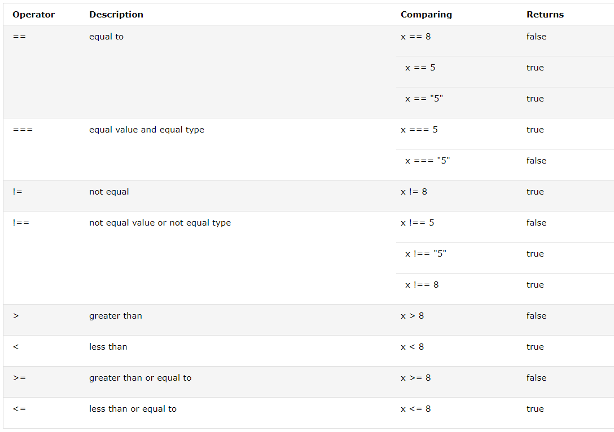

# Comparison and Logical Operators
Comparison and Logical operators are used to test for true or false.

Comparison operators are used in logical statements to determine equality or difference between variables or values such as greater than or less than, etc.

For example, given that x = 5, the table below explains the comparison operators:

# Loops
Loops can execute a block of code a number of times. Loops are handy, if you want to run the same code over and over again, each time with a different value.

JavaScript supports different kinds of loops:

for - loops through a block of code a number of times
for/in - loops through the properties of an object
for/of - loops through the values of an iterable object
while - loops through a block of code while a specified condition is true
do/while - also loops through a block of code while a specified condition is true

